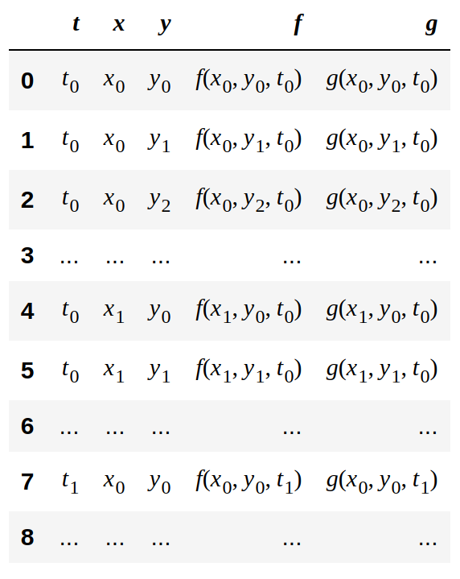
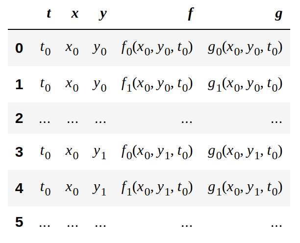
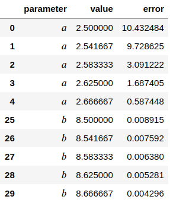
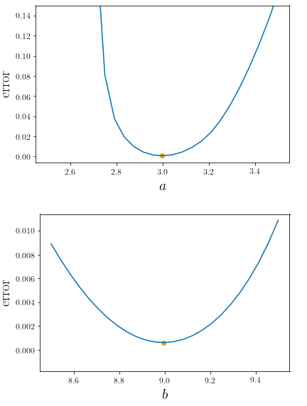
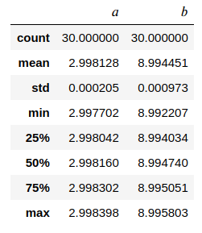
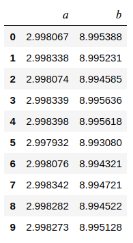
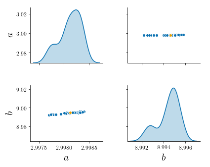

PDEparams
=========

A module for parameter estimation in partial differential equations
(PDEs) using the Differential Evolution (DE) algorithm.

Requirements
------------

-   `python 3.x`
-   `numpy`
-   `pandas`
-   `scipy`
-   `scikit-learn`
-   `tqdm>=4.29.0`
-   `matplotlib` (plots only)
-   `seaborn` (plots only)
-   LaTeX (plots only)

Usage
-----

The module consists of a constructor that prepares the data and the
model to be fit, along with a series of routines to find the best fit
parameters, compute likelihood profiles and perform bootstrapping, as
well as visualising the results.

### The `PDEmodel` object

The main component of the module, it is initialised as

``` python
import PDEparams as pde

my_object = pde.PDEmodel(data, model, initfunc, bounds, param_names=None, nvars=1,
                         ndims=1, nreplicates=1, obsidx=None, outfunc=None)
```

#### Required arguments

##### 1. `data`

The data is assumed to be in the form of a pandas `DataFrame`. You can
construct a `DataFrame` directly from file as, *e.g.*,

``` python
import pandas as pd

data = pd.read_csv('data_file.csv')

# or
data = pd.read_excel('data_file.xlsx')
```

Refer to the [pandas
documentation](https://pandas.pydata.org/pandas-docs/stable/reference/api/pandas.read_csv.html)
for details. Another, not recommended, way of constructing the
`DataFrame` is to manually input the values:

``` python
data_values = [[t0, x0, f(t0,x0)], [t0, x1, f(t0,x1)], ..., [t1, x0, f(t1,x0)], [t1, x1, f(t1,x1)], ...]

data = pd.DataFrame(data_values)
```

The data should be structured so that the first column corresponds to
the timepoints, followed by the spatial coordinates and the outputs. For
instance, the data for a two-dimensional system with coordinates
")
and two variables,  and
, will have the form



**\* Note the order in which the spatial coordinates are entered in the
data. The index of the right-most coordinate runs first; *e.g.*, for a
3D system, after
"),
")
should follow.**<br> **\*\* The name of the columns is not important,
the dimensionality of the system is defined by the user with the
arguments `noutputs` and `ndims` (see below).**

If more than one measurement per space-time coordinate exists, they
should be entered consecutively, as in



We refer to these as ‘replicates’. The number of replicates is
controlled by the parameter `nreplicates` (see below). If you have one
data file per replicate—let us say 3 different `.csv` files—you can
merge them with

``` python
data_1 = pd.read_csv('data_1.csv')
data_2 = pd.read_csv('data_2.csv')
data_3 = pd.read_csv('data_3.csv')

data = data_1.append([data_2, data_3], ignore_index=False).sort_index().reset_index(drop=True)
```

This will result in a `DataFrame` where the first 3 rows correspond to
the first row of each of the data files, and so on, as in the picture
above.

##### 2. `model`

This is the PDE or system of PDEs that fits the data. It should be
defined as a function of the initial condition, the time domain, the
spatial grid, and the parameters to be estimated, and it should return
the *time derivative* of the variables in the system. It would look like
this:

``` python
def my_pde(initial_condition, time_domain, spatial_grid, parameter_1, parameter_2, ...):

  variables = ... # preprocessing of initial condition

  dobs_dt = ... # the equation for the time derivative

  dobs_dt[boundaries] = ... # boundary conditions

  output = ... # postprocessing of dobs_dt

  return output
```

The preprocessing step mentioned above corresponds to retrieving the
actual shape of the system given the input: the integration is handled
using `scipy`’s `odeint`, which only accepts one-dimensional inputs. If
we imagine a system of 2 equations in 1 spatial dimension, we need to
feed the initial condition for both variables as one long array, instead
of two arrays. The preprocessing step then retrieves these two original
arrays; after the time derivative is calculated for both variables, the
postprocessing converts the two derivatives into one long derivative.
While more convoluted, the idea is the same for a larger number of
spatial dimensions.

The module takes care of feeding the model the correct one-dimensional
input regardless of the actual dimensionality of the problem. The
preprocessing inside the model needs to be hardcoded, but full
illustrations appear in the [examples directory](./examples/).

**Note that the module also works for ODEs—see details below and in the
[examples directory](./examples/). In this case, the definition of the
system should not include the `spatial_grid` argument.**

##### 3. `initfunc`

This is the initial condition generator. Each of the variables in the
system will have an initial condition that is a function of the spatial
grid, as in

``` python
def initial_f(grid_point):
  ...

def initial_g(grid_point):
  ...
```

`initfunc` should be a list comprising those functions:

``` python
initfunc = [initial_f, initial_g]
```

See more details in the [examples directory](./examples/).

**For ODEs, the initial condition should still be defined as a function
for each of the variables in the system.**

##### 4. `bounds`

The optimisation performed by DE is constrained and, therefore, bounds
for the parameter values must be provided. These should be in the form
of a tuple of tuples or list of tuples.

``` python
bounds = ((lower_1, upper_1), (lower_2, upper_2) ...)

# or
bounds = [(lower_1, upper_1), (lower_2, upper_2) ...]
```

#### Optional arguments

##### 1. `param_names`

List of parameter names, for use in plots and output tables. If not
specified, they will be called `'parameter_1'`, `'parameter_2'`, etc.

##### 2. `nvars`

The number of variables in the system of equations. If not specified, it
is assumed to be 1.

##### 3. `ndims`

The number of spatial coordinates in the data—`ndims=0` for ODEs. If not
specified, it is assumed to be 1.

##### 4. `nreplicates`

The number of measurements per space-time coordinate in the data. If not
specified, it is assumed to be 1.

##### 5. `obsidx`

In the case when not all variables in the system are actually observed,
we need to specify for which of them we have data. `obsidx` is a list of
indices, starting from zero, corresponding to the position of the
observed variables in the model we have defined. For instance, if we
have a three-dimensional state vector with data for the second and third
variables, we should pass

``` python
obsidx=[1,2]
```

If only one variable is observed, `obsidx` can be either an integer or a
list of one integer. In the case above, if we now have data only for the
third variable:

``` python
obsidx=2

# or
obsidx=[2]
```

`obsidx` defaults to `None`, meaning that all variables are measured.

#### 6. `outfunc`

Sometimes we do not have data for the raw variables in the system but
rather a function of them. This is specified by `outfunc`, which
defaults to `None`, meaning we have data for the raw outputs. For
instance, if we can only measure the square of the third variable in a
three-dimensional system, we should define

``` python
def outfunc(state_vector):
  x, y, z = state_vector

  return z**2
```

and pass this argument to the `PDEmodel` constructor.

**Note that, if `outfunc` is specified, the argument `obsidx` is
overridden. The function is always a function of the full state vector,
even if the actual measured quantity only involves a few of the
variables, as shown above.**

### Functions and attributes

Upon construction, the initial condition functions are applied to the
spatial grid and stored in the attribute `initial_condition`—for the
example above, this can be retrieved by calling
`my_object.initial_condition`. As a sanity check, it may be helpful to
plot this initial condition; this is not part of the module, but the
[examples directory](./examples/) contains some visualisation code.

Additionally, the time-step between the first and second datapoints is
obtained, and an array of timepoints is constructed starting from
 and ending at
the first datapoint, using this time-step. This is prepended to the
timepoints in the data and stored as the attribute `time`.

Other attributes include: - `model` - `data` - `nvars` - `spacedims`:
the value of `ndims` in the input - `nparams`: the number of parameters
- `space`: the spatial grid

#### Finding the best fit

The optimisation is carried out by calling

``` python
my_object.fit()
```

If no argument is given, the cost function to minimise will be the mean
squared error. For other cost functions, you need to provide the `error`
argument; for instance, for the root mean squared error:

``` python
my_object.fit(error='rmse')
```

Possible choices for `error` are: 
- `'mse'`: mean squared error
- `'rmse'`: root mean squared error
- `'msle'`: mean squared logarithmic error
- `'rmsle'`: root mean squared logarithmic error
- `'mae'`: mean absolute error
- `'medae'`: median absolute error

The results are displayed on screen and stored in the attribute
`best_params`, while the optimum value of the cost function is stored in
the attribute `best_error`.

#### Computing likelihood profiles

Likelihood profiles are computed for each parameter by fixing its value
and refitting the rest of the parameters. This is done using

``` python
my_object.likelihood_profiles()
```

A list of parameter values to try can be explicitly given for each parameter in the model, using the optional argument `param_values`&mdash;this should be a list of lists or a list of arrays, and its size must coincide with the number of parameters. For instance, in oder to use the values `[1,2,3]` for the first and `[4,5,6]` for the second parameter in a model with two parameters, use

``` python
my_object.likelihood_profiles(param_values=[[1,2,3], [4,5,6]])
```

If no explicit values are provided, the likelihood profiles will be computed using a regular grid within the parameter bounds for each parameter. There is a second optional argument, `npoints`, that controls the number of points to use in the grid. If no argument is given, a regular grid of 100 points will be used per parameter. For, *e.g.*, 250 points per parameter, use

``` python
my_object.likelihood_profiles(npoints=250)
```

The full results are stored as a `DataFrame` in the form



and can be retrieved with `my_object.likelihood_profiles`

For a quick look at the profiles, use

``` python
my_object.plot_profiles()
```

You should see something like this:



If the best fit parameters have already been obtained via the `fit()`
function, the cost function to be used for the likelihood profiles will
match the original cost function—additionally, the best fit parameters
will be highlighted in the plots. If not, the likelihood profiles will
be computed with the default mean squared error.

#### Bootstrapping (only for `nreplicates>1`)

Bootstrapping is carried out by randomly choosing one replicate per
spatio-temporal coordinate and refitting all parameters in multiple
rounds. Done using

``` python
my_object.bootstrap()
```

If no argument is given, the process is repeated 100 times. For other
configurations, use the optional `nruns` argument; *e.g.*,

``` python
my_object.bootstrap(nruns=250)
```

A summary of the results is displayed on screen and stored as a
`DataFrame` in the attribute `bootstrap_summary`, while the full results
are stored as a `DataFrame` in the attribute `bootstrap_raw`.
Respectively,

**Summary:**



**Full:**



For a quick look at the results, use

``` python
my_object.plot_bootstrap()
```

You should see something like this:



If the best fit parameters have already been obtained via the `fit()`
function, the cost function to be used for bootstrapping will match the
original cost function—additionally, the best fit parameters will be
highlighted in the plots. If not, the default mean squared error will be
used.

References
----------

R. Storn, and K. Price. “Differential evolution–a simple and efficient
heuristic for global optimization over continuous spaces”, *Journal of
Global Optimization* **11(4)**, pp. 341-359 (1997).

A. Raue, C. Kreutz, T. Maiwald, J. Bachmann, M. Schilling, U.
Klingmüller, and J. Timmer. “Structural and practical identifiability
analysis of partially observed dynamical models by exploiting the
profile likelihood”, *Bioinformatics* **25(15)**, pp. 1923-1929 (2009).
